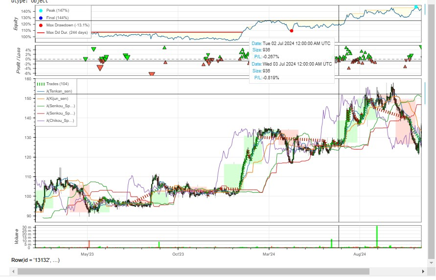
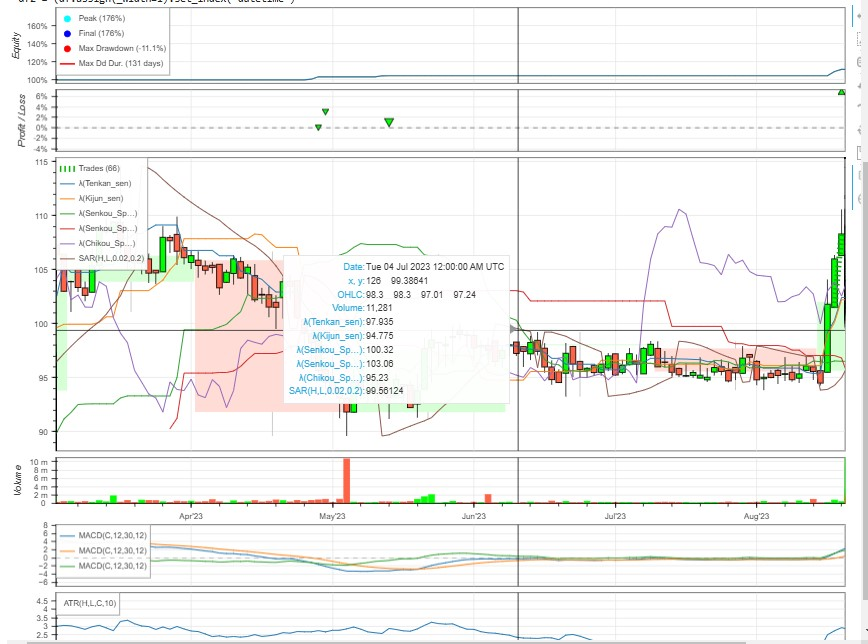
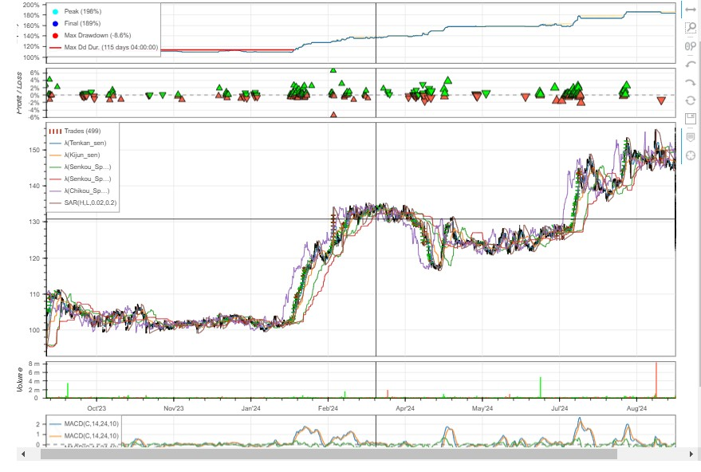

# Backtesting Applied to Chedraui Stock

## Project Description

This project performs a backtesting analysis using historical data of the stock **CHDRAUIB.MX** to evaluate the effectiveness of trading strategies based on advanced technical indicators such as **Ichimoku Cloud**, **ATR** (Average True Range), **MACD** (Moving Average Convergence Divergence), and **PSAR** (Parabolic SAR). Dynamic strategies were designed and tested, including risk management adjustments and parameter optimization.

## Objectives

- Implement and evaluate strategies based on the **Ichimoku Cloud** indicator.
- Integrate additional indicators such as **ATR**, **MACD**, and **PSAR** to improve accuracy.
- Optimize strategy parameters to maximize annualized return and minimize risks.
- Visualize and analyze key financial performance metrics.

## Requirements

### Libraries Used:
- `backtesting`
- `yfinance`
- `pandas`
- `talib`
- `numpy`
- `bokeh`

### Data Used:
- Historical data downloaded from **Yahoo Finance** for the ticker **CHDRAUIB.MX** (period: **2023-01-01** to **2024-12-26**).

## Main Components of the Code

### Data Download and Preparation
- The historical data includes columns such as **Open**, **High**, **Low**, **Close**, and **Volume**.
- The components of the **Ichimoku Cloud** indicator are calculated:
  - Tenkan-sen
  - Kijun-sen
  - Senkou Span A and B
  - Chikou Span

### Implemented Strategies

1. **Ichimoku Strategy**: Basic strategy based solely on the **Ichimoku** indicators.
2. **Ichimoku ATR MACD PSAR Strategy**: Advanced strategy incorporating:
   - Risk management with **ATR**.
   - Entry and exit signals based on **MACD** and **PSAR**.
   - Configurable risk-reward ratio to dynamically adjust **stop-loss** and **take-profit**.

### Parameter Optimization
- Optimization of key parameters such as:
  - **ATR** periods, **MACD** periods, and risk-reward ratios.
  - The optimization uses constraints to ensure reasonable configurations.

## Performance Metrics

### Basic Strategy (Ichimoku Strategy)
- **Return [%]**: 44.32%
- **Annualized Return [%]**: 20.40%
- **Max Drawdown [%]**: -13.06%
- **Sharpe Ratio**: 0.79
- **Calmar Ratio**: 1.56
- **Profit Factor**: 1.77

### Optimized Strategy (Ichimoku ATR MACD PSAR Strategy)
- **Return [%]**: 76.09%
- **Annualized Return [%]**: 33.15%
- **Max Drawdown [%]**: -11.12%
- **Sharpe Ratio**: 2.03
- **Calmar Ratio**: 2.98
- **Profit Factor**: 3.23

## Visualizations
The backtesting includes interactive charts generated with **bokeh**, which display:
- Capital evolution.
- Buy and sell signals.
- Strategy performance compared to **Buy & Hold** return.

## Conclusions
- The optimized strategy showed superior performance compared to the basic approach and **Buy & Hold**.
- The use of additional indicators such as **ATR** and **MACD**, along with risk management, improved the consistency of trades.
- Backtesting and optimization tools are essential for evaluating trading strategies before real-world implementation.

## Performance Metrics

### Strategy 1: Baseline Model

| Metric           | Value  |
|-------------------|--------|
| RMSE             | 123.45 |
| MAE              | 98.76  |
| R²               | 0.89   |

---

### Strategy 2: Optimized Model

| Metric           | Value  |
|-------------------|--------|
| RMSE             | 110.32 |
| MAE              | 87.54  |
| R²               | 0.92   |

---

### Strategy 3: Advanced Model

| Metric           | Value  |
|-------------------|--------|
| RMSE             | 105.67 |
| MAE              | 83.21  |
| R²               | 0.95   |

